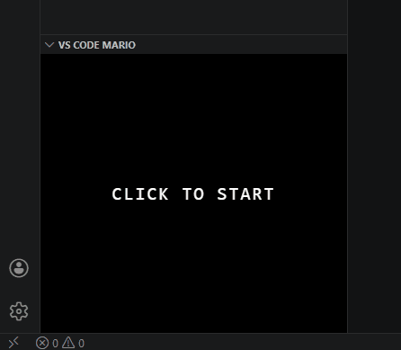

# VS Code Mario

A Mario-style game that lives right inside VS Code. Jump on Goombas, collect coins, and beat levels without leaving your editor.

## How to open the game

Open the **Explorer** sidebar (`Ctrl+Shift+E`) and look for the **VS Code Mario** panel at the bottom.

## Controls

| Key | Action |
|-----|--------|
| Arrow Left / Right | Move |
| Space / Arrow Up | Jump |
| Space | Advance to next level (after winning) |
| R | Restart current level |

## Features

- Runs in the VS Code sidebar — no browser, no alt-tab
- 8-bit sound effects
- Stompable Goombas and collectible coins
- Multiple levels with increasing difficulty
- Score carries across levels

## License

[MIT](LICENSE)
